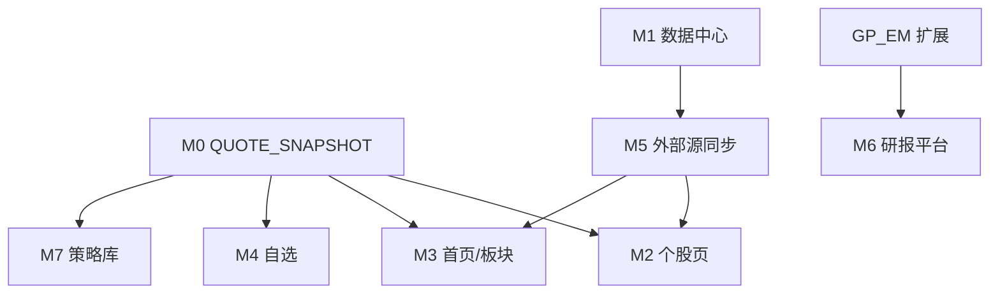

# GoldenProject — 后端数据处理开发计划

本文档对照 UI 设计稿，梳理**当前已有能力**与**仍缺的后端数据处理 / API**，并给出推荐开发步骤。  
优先做「数据入库 + 聚合计算 + 查询接口」，前端页面可在此基础上逐步对接。

---

## 1. 当前架构概览

```
通达信本地 (GP_TDX)          东方财富 (GP_EM)           计算层 (GP_FSA / GP_TECH / GP_AI)
  QUATE / CW / gbbq     →         研报 / 定期报告    →      FSA 比率 / 技术扫描 / AI 建议
  STOCK / STOCKINFO              EM_RESEARCH / EM_FILING
                ↓                           ↓
                     MongoDB (tdx / kdb / site)
                ↓
              GP_KDB 查询层
                ↓
         Django API (backend/api)
                ↓
            React 前端
```

### 1.1 已有模块

| 模块 | 职责 | Mongo 集合（主要） |
|------|------|-------------------|
| **GP_TDX** | 股价、财务 CW、分红股本、STOCK/STOCKINFO | `QUATE`, `CW`, `STOCK_PKVZGB`, `STOCK`, `STOCKINFO` |
| **GP_FSA** | 由 CW 计算财务比率 | `FSA` |
| **GP_EM** | 研报 + 定期报告同步 | `EM_RESEARCH`, `EM_FILING` |
| **GP_KDB** | 行情/行业/股票池/热力图查询 | 读 `tdx.*`, `kdb.dates`, `site.*` |
| **GP_TECH** | 上升通道、独立走强、行业相关度 | 读 `QUATE` |
| **GP_AI** | LightGBM 买入建议 | 读 FSA + QUATE，写确认记录 |

### 1.2 已有 API（节选）

| 路由 | 说明 |
|------|------|
| `GET /api/stock/<ide>/` | STOCK 基础元信息 |
| `GET /api/stock/<ide>/fdk/` | K 线 OHLCV |
| `GET /api/stock/<ide>/cw/*` | 财务报表 |
| `GET /api/stock/<ide>/fsa/` | 最新 FSA 比率 |
| `GET /api/stock/<ide>/reports/` | 个股研报 + 定期报告 |
| `GET /api/market/heatmap/` | 市场热力图 |
| `GET /api/hy/*` | 行业板块 |
| `GET /api/pool/*` | 股票池（自选） |
| `POST /api/compare/` | 多股对比（FSA + 涨幅） |
| `POST /api/tech/*`, `/api/ai/advice/*` | 技术扫描、AI 建议 |
| `GET/POST /api/update/*` | 数据中心任务（含 `GET /api/update/jobs/`） |

---

## 2. 设计稿 vs 后端缺口总表

图例：**有** = 可直接用或轻微扩展；**部分** = 有底层数据但缺聚合 API；**缺** = 需新数据源或新模块。

| 设计页面 | 数据块 | 状态 | 缺什么 |
|----------|--------|------|--------|
| **数据中心** | 任务触发 / 历史 / 目录检测 | 部分 | 任务持久化、日志流、集合级同步元数据、数据质量检查 |
| **首页** | 四大指数快照 | 部分 | 最新价/涨跌/量额聚合 API |
| | 涨跌家数、涨跌停 | 缺 | 全市场 breadth 统计 |
| | 资金流向 donut | 缺 | 主力/大中小单资金流 |
| | 自选 Top、排行榜 | 部分 | 批量 quote + 排序 API |
| | 北向资金 | 缺 | 沪股通/深股通时序 |
| | 资讯流 | 缺 | 新闻/公告聚合 |
| | 研报精选 | 部分 | 全局 curated + 评分 |
| **自选** | 分组列表 | 有 | `pool/*` |
| | 现价/PE/PB/市值/迷你 K 线 | 部分 | 批量估值快照 API |
| | 分组汇总、行业分布、财报季 | 缺 | pool summary 聚合 |
| | 异动提醒 | 缺 | 规则引擎 + 告警 API |
| **行情/板块** | 热力图 | 有 | `market/heatmap` |
| | 板块概况/PE/PB/资金流 | 部分 | sector summary API |
| | 板块 K 线 vs 基准 | 部分 | 行业指数 IDE + fdk |
| | 成分股完整估值表 | 部分 | hy stocks + 估值 enrich |
| **个股页** | K 线、三表、FSA、研报 | 有 | — |
| | 顶部行情栏（PE/PB/市值） | 缺 | quote + valuation API |
| | 公司概况 F10 | 部分 | STOCKINFO 已入库，无查询 API；缺成立/上市/员工等字段扩展 |
| | 5 日资金流向 | 缺 | 个股资金流 |
| | 同业对比 | 部分 | 需 `peers` + PE/PB |
| | 能力雷达图 | 缺 | 五维得分 + 行业基准 |
| | 估值区间（PE 历史分位） | 缺 | 估值时序 + 分位计算 |
| | 最新公告（非仅定期报告） | 部分 | EM_FILING 不全；需公告源 |
| **研报平台** | 个股研报列表 | 有 | `stock/reports` |
| | 全局检索/筛选/facet 计数 | 缺 | search + facets API |
| | 词云/行业 TOP/评级分布 | 缺 | stats 聚合 API |
| | 评级、摘要、关键词 | 部分 | EM 同步字段需扩展 |
| | 我的收藏 | 缺 | 用户维度 favorites |
| **策略库** | 策略卡片/回测/信号 | 缺 | 策略实体 + 回测引擎 + 绩效 API |

---

## 3. 开发原则

1. **先数据、后接口、最后前端**：每个页面先定 Mongo 表结构与同步任务，再写 GP_* 模块，最后暴露 REST。
2. **能算的不存、该存的预计算**：估值分位、雷达得分等日更任务写入快照表，接口只读。
3. **批量优先**：首页/自选/板块都需要 `ides[]` 批量查询，避免 N+1。
4. **数据源先决策再开工**：资金流、北向、新闻、流通股本见 [§9](#9-待决策项)。

---

## 4. 分阶段开发步骤

### 阶段 0 — 公共底座（优先，1～2 周）

目标：后续所有页面共用的「行情 + 估值 + 批量查询」能力。

#### 0.1 新建模块 `GP_QUOTE`（或在 GP_KDB 扩展）

| 步骤 | 内容 | 产出 |
|------|------|------|
| 0.1.1 | 从 `tdx.QUATE` 取最新交易日 OHLCV + 昨收 | 函数 `latest_quote(ide)` |
| 0.1.2 | 从 `STOCK_PKVZGB` 取最新 `ZGB`（总股本） | 函数 `latest_shares(ide)` |
| 0.1.3 | 从 `tdx.FSA` / CW 取最新 BPS、TTM 净利润/EPS（口径需统一） | 函数 `latest_fundamentals(ide)` |
| 0.1.4 | 计算：`总市值 = 现价 × ZGB`，`PB = 市值 / 净资产`，`PE-TTM = 市值 / TTM 净利润` | 函数 `valuation_snapshot(ide)` |
| 0.1.5 | 批量版：`quotes_for_ides(ides)`, `valuations_for_ides(ides)` | 供列表/热力图/自选 |

**新集合（建议）**：`tdx.QUOTE_SNAPSHOT`（按 `IDE + DT` 存每日估值快照，供历史分位）

| 字段 | 说明 |
|------|------|
| IDE, DT | 主键 |
| close, chg_pct, open, high, low, volume, amount | 行情 |
| zgb, total_mv | 股本、总市值 |
| pe_ttm, pb_lf, bps | 估值 |
| roe, gross_margin | 可选，来自 FSA |

**同步任务**：在 `quote` 更新完成后增量写入 snapshot（扩展 `GP_TDX` 或 `data_update` task）。

#### 0.2 API

```
GET  /api/stock/<ide>/quote/           # 个股顶部行情栏
POST /api/stocks/quotes/               # body: { ides: [...] } 批量快照
GET  /api/market/indices/              # 四大指数 + 涨跌 + 量额
```

#### 0.3 暴露 F10

| 步骤 | 内容 |
|------|------|
| 0.3.1 | `GP_KDB` 增加 `company_profile(ide)` 读 `STOCKINFO` |
| 0.3.2 | 扩展 `GP_TDX.stockinfo` 解析字段：成立日期、上市日期、员工人数、公司简介（若 TDX F10 有） |
| 0.3.3 | `GET /api/stock/<ide>/profile/` |

**验收**：个股页顶部栏、首页指数卡、自选表格能拿到统一 JSON。

---

### 阶段 1 — 数据中心增强（1 周）

目标：设计稿中「数据概览 / 任务中心 / 日志 / 质量」后端能力。

| 步骤 | 内容 | 产出 |
|------|------|------|
| 1.1 | 任务历史持久化到 Mongo `site.UPDATE_JOBS`（可选，替代纯内存） | 重启不丢历史 |
| 1.2 | 集合级同步元数据 `site.SYNC_META`：`collection`, `last_success_at`, `doc_count`, `latest_dt` | 最近成功同步面板 |
| 1.3 | TDX 目录扫描：股票 `.day` 文件数、估算体积 | `GET /api/update/scan/` |
| 1.4 | 数据质量检查 task：QUATE 最新日期、FSA 覆盖率、EM 空字段率 | `POST /api/update/quality/` |
| 1.5 | 任务日志：worker 写 `site.UPDATE_LOGS`（job_id + line） | `GET /api/update/jobs/<id>/logs/` |

**API 汇总**

```
GET  /api/update/overview/             # 概览：各集合 last_sync + 统计
GET  /api/update/jobs/                 # 已有
GET  /api/update/jobs/<id>/logs/       # 新增
GET  /api/update/scan/                 # TDX 目录扫描
POST /api/update/quality/              # 质量检查
```

---

### 阶段 2 — 个股页补全（1～2 周）

| 步骤 | 模块/API | 说明 |
|------|----------|------|
| 2.1 | `GET /api/stock/<ide>/peers/` | 按 HY2 从 `BKHY.stocks` 取同业 Top N，批量 attach quote + FSA + valuation |
| 2.2 | `GET /api/stock/<ide>/valuation-range/` | 读 `QUOTE_SNAPSHOT` 近 5 年 PE-TTM，返回 min/median/max/current/percentile |
| 2.3 | `GET /api/stock/<ide>/ability-radar/` | 五维得分（盈利/成长/估值/运营/偿债）+ 行业 median；计算逻辑放 `GP_FSA` 或新 `GP_SCORE` |
| 2.4 | `GET /api/stock/<ide>/fsa/summary/` | 最新一季 ROE/毛利率/净利率/营收增速等单页快照（扩展 FSA 字段含净利率） |
| 2.5 | 公告 | 扩展 `GP_EM` 同步「临时公告」或接第三方；`GET /api/stock/<ide>/announcements/` |

**雷达得分输入（示例）**

| 维度 | 指标来源 |
|------|----------|
| 盈利 | ROE、毛利率、净利率 |
| 成长 | 营收 YoY、净利润 YoY |
| 估值 | PE/PB 在行业分位 |
| 运营 | 资产周转、费用率 |
| 偿债 | 资产负债率、流动比率 |

---

### 阶段 3 — 首页 + 市场行情（1～2 周）

#### 3.1 市场概览 `GP_MARKET`

| 步骤 | 内容 |
|------|------|
| 3.1.1 | `market_breadth(dt)`：统计当日涨跌平家数、涨停跌停（需涨跌幅 + 涨跌停规则） |
| 3.1.2 | `market_distribution(dt)`：涨跌幅区间 histogram |
| 3.1.3 | `market_rankings(kind, limit)`：涨幅榜/跌幅榜/成交额/换手率 |

```
GET /api/market/summary/               # 指数 + breadth + 最新 DT
GET /api/market/breadth/
GET /api/market/rankings/?kind=chg&limit=20
```

#### 3.2 板块页增强

| 步骤 | API |
|------|-----|
| 3.2.1 | 板块汇总：成分数、加权 PE、median 涨跌幅、成交额 | `GET /api/sector/<ids>/summary/` |
| 3.2.2 | 板块指数 K 线（BKHY.IDE） | `GET /api/sector/<ids>/fdk/` |
| 3.2.3 | 成分股 + 估值列 | 扩展 `GET /api/hy/<ids>/stocks/` enrich valuation |

#### 3.3 外部数据（见阶段 5）

- 全市场 / 板块 / 个股 **资金流向**
- **北向资金** intraday 序列

---

### 阶段 4 — 自选页（1 周）

| 步骤 | API | 说明 |
|------|-----|------|
| 4.1 | `GET /api/pool/summary/?category=` | 股票数、均涨幅、Top 行业、加权 PE/PB 分位 |
| 4.2 | 扩展 `GET /api/pool/stocks/` | 合并 quote snapshot：现价、市值、PE、PB、5 日 sparkline 数据点 |
| 4.3 | `GET /api/pool/insights/?category=` | 组内涨幅 Top5、行业市值分布 |
| 4.4 | `GET /api/pool/earnings-season/?category=` | 财报披露进度（对比 FSA REPORTDATE / EM_FILING） |
| 4.5 | `GET /api/pool/alerts/?category=` | 异动：涨跌幅/量比阈值（规则可配置） |

---

### 阶段 5 — 外部数据源接入（并行，2～3 周）

设计稿中无法单靠 TDX 本地数据完成的部分。

#### 5.1 新建 `GP_FLOW` — 资金流向

| 项 | 说明 |
|----|------|
| 数据源 | 东方财富 / 同花顺 / TDX 扩展（待定） |
| 集合 | `tdx.MONEY_FLOW_D`（IDE, DT, main/large/mid/small net） |
| 同步 | `data_update` 新 task `moneyflow` |
| API | `GET /api/stock/<ide>/money-flow/?window=5`，`GET /api/market/money-flow/`，`GET /api/sector/<ids>/money-flow/` |

#### 5.2 新建 `GP_NORTH` — 北向资金

| 集合 | `tdx.NORTH_FLOW`（DT, time, sh, sz, total） |
| API | `GET /api/market/northbound/?date=` |

#### 5.3 新建 `GP_NEWS` — 资讯与公告

| 集合 | `tdx.NEWS`（title, dt, source, tags, related_ide） |
| API | `GET /api/news/feed/?kind=important&limit=20` |
| 与 EM 关系 | 定期报告继续走 `EM_FILING`；临时公告走 NEWS 或扩展 EM |

#### 5.4 流通股本（若需流通市值）

- 确认数据源；写入 `STOCK_PKVZGB` 或新字段 `LTGB`
- 快照表增加 `float_mv`

---

### 阶段 6 — 研报平台（1～2 周）

#### 6.1 扩展 `GP_EM` 入库字段

| 字段 | 用途 |
|------|------|
| rating | 评级（买入/增持…） |
| rating_change | 评级变动 |
| abstract / summary | 摘要 |
| keywords | 关键词数组 |
| target_price | 目标价（如有） |

#### 6.2 检索与统计

| API | 说明 |
|-----|------|
| `GET /api/research/search/` | q, industry, org, rating, kind, date_from/to, page |
| `GET /api/research/facets/` | 各筛选项 + count（Mongo aggregation） |
| `GET /api/research/stats/` | 词云、行业 TOP10、评级分布、近期更新数 |
| `POST /api/research/favorites/` | 收藏（`site.RESEARCH_FAV`，按 username） |

#### 6.3 索引

```javascript
// EM_RESEARCH 建议索引
{ publishDate: -1 }
{ stockCode: 1, publishDate: -1 }
{ industryCode: 1, publishDate: -1 }
{ orgCode: 1, publishDate: -1 }
{ rating: 1 }
// 全文（可选）
{ title: "text", abstract: "text" }
```

---

### 阶段 7 — 策略库（3～4 周，依赖阶段 0）

#### 7.1 新建 `GP_STRATEGY` + `GP_BACKTEST`

| 集合 | 说明 |
|------|------|
| `site.STRATEGY` | id, name, tags, factors[], rebalance, status |
| `site.BACKTEST_RUN` | strategy_id, params, metrics, equity_curve[] |
| `site.STRATEGY_SIGNAL` | strategy_id, ide, strength, triggered_at |

#### 7.2 引擎

| 步骤 | 说明 |
|------|------|
| 7.2.1 | 因子条件 → 复用 `screen_stocks` + FSA + valuation snapshot |
| 7.2.2 | 回测：按 rebalance 日调仓，算净值/回撤/Sharpe/年化 |
| 7.2.3 | 基准：指数 `fdk`（如 sh000300） |

#### 7.3 API

```
GET  /api/strategies/
GET  /api/strategies/<id>/
GET  /api/strategies/<id>/equity/
GET  /api/strategies/<id>/holdings/
GET  /api/strategies/<id>/signals/
POST /api/strategies/<id>/backtest/
```

---

## 5. 推荐实施顺序（里程碑）

```
M0  阶段 0   QUOTE_SNAPSHOT + /quote/ + /profile/          ← 最先做
M1  阶段 1   数据中心 overview / sync_meta / quality
M2  阶段 2   个股 peers / valuation-range / radar / 公告
M3  阶段 3   首页 summary / breadth / rankings + 板块 summary
M4  阶段 4   自选 pool summary + enrich
M5  阶段 5   资金流 / 北向 / 新闻（数据源确定后）
M6  阶段 6   研报 search / facets / stats
M7  阶段 7   策略库 + 回测
```

依赖关系：



---

## 6. 目录与文件规划（建议）

```
modules/
  GP_QUOTE/          # 行情快照、估值计算（阶段 0）
    snapshot.py
    valuation.py
  GP_MARKET/         # 市场 breadth、排行榜（阶段 3）
  GP_FLOW/           # 资金流向（阶段 5）
  GP_NORTH/          # 北向资金（阶段 5）
  GP_NEWS/           # 资讯公告（阶段 5）
  GP_SCORE/          # 雷达得分、综合评分（阶段 2）
  GP_STRATEGY/       # 策略定义（阶段 7）
  GP_BACKTEST/       # 回测引擎（阶段 7）

backend/api/
  views_quote.py     # 或按域拆分 views
  views_market.py
  views_research.py
  data_update.py     # 持续扩展 sync task
```

---

## 7. 数据更新任务扩展清单

在现有 `quote | cw | dividend | stockinfo | fsa | report` 基础上增加：

| task key | 模块 | 写入集合 |
|----------|------|----------|
| `quote_snapshot` | GP_QUOTE | `QUOTE_SNAPSHOT`（可合并进 quote 任务尾部） |
| `moneyflow` | GP_FLOW | `MONEY_FLOW_D` |
| `northbound` | GP_NORTH | `NORTH_FLOW` |
| `news` | GP_NEWS | `NEWS` |
| `announcements` | GP_EM 扩展 | `EM_ANNOUNCE` 或 NEWS |
| `quality` | GP_KDB | 只读检查，写 `SYNC_META` |

---

## 8. 阶段 0 详细任务清单（建议立即开工）

以下为 **M0** 的可执行 checklist：

- [ ] **GP_QUOTE**：实现 `latest_quote`, `latest_shares`, `valuation_snapshot`
- [ ] **GP_QUOTE**：实现 `build_daily_snapshots(dt)` 写入 `tdx.QUOTE_SNAPSHOT`
- [ ] **data_update**：`quote` 任务完成后触发 snapshot 增量
- [ ] **GP_KDB**：`company_profile(ide)` 读 `STOCKINFO`
- [ ] **GP_TDX**：扩展 F10 解析（成立/上市/员工/简介）
- [ ] **API**：`GET /api/stock/<ide>/quote/`
- [ ] **API**：`POST /api/stocks/quotes/`
- [ ] **API**：`GET /api/market/indices/`
- [ ] **API**：`GET /api/stock/<ide>/profile/`
- [ ] **索引**：`QUOTE_SNAPSHOT` 上 `(IDE, DT)` unique
- [ ] **Notebook/测试**：`Ipython/get_stock_info.ipynb` 对齐新字段， smoke test API

---

## 9. 待决策项

开工前需要产品/数据口径确认：

| 项 | 选项 | 影响 |
|----|------|------|
| 资金流数据源 | 东财 / 同花顺 / 暂无 | 阶段 5 是否阻塞首页/个股右侧 |
| 北向资金 | 同上游或 AkShare 等 | 首页北向图 |
| PE-TTM 口径 | 总市值 / 归母净利润 TTM；亏损股处理 | 估值快照、分位 |
| 流通市值 | 是否有 LTGB 数据源 | 设计稿「流通市值」列 |
| 研报评级 | EM 接口是否含 rating 字段 | GP_EM 同步 schema |
| 任务历史 | 内存 / Mongo 持久化 | 数据中心重启后历史 |
| 用户体系 | 收藏/笔记是否要多用户 | site 集合按 username 隔离 |

---

## 10. 相关文档与代码入口

| 路径 | 说明 |
|------|------|
| `backend/api/urls.py` | API 路由 |
| `backend/api/data_update.py` | 数据更新任务 |
| `modules/GP_TDX/` | 通达信入库 |
| `modules/GP_EM/` | 研报/定期报告 |
| `modules/GP_KDB/functions_stock.py` | 涨幅、FSA 批量 |
| `modules/GP_FSA/` | 财务比率计算 |
| `frontend/src/pages/DataUpdate.jsx` | 数据中心 UI |

---

## 11. 修订记录

| 日期 | 说明 |
|------|------|
| 2026-08-20 | 初版：对照 UI 设计稿整理后端数据处理开发步骤 |
# GoldenProject
